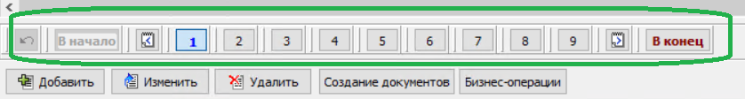

[На главную](../../index.md)

# Новое  в версии. Релиз 274 от 28.05.2024

**Условные обозначения:**
 >[номер] - номер заявки во внутренней системе учета заявок компании "БУХта".

#### Содержание: 

- Зарплата
- Отчеты

## Добавление новой возможности

#### 25215
Разработан постраничный способ отображения некоторых справочников. Для этого,
в __Локалные настройки__, на закладки __Справочники__ и __Договоры/Документы__ добавлены настройки для включения/выключения постраничного вывода данных.
На закладке __Общие__ расположена настройка отвечающая за количество выводимых строк на одной странице.

>Дополнения
- Постраничный способ не поддерживается, если включен иерархический вывод данных.
- Фильтрация и поиск данных выполняются по всем страницам списка.
- Отметка строк выполняется по текущей странице. 
- Подсчет итогов выполняется по текущей странице.
- Печать по F9 выполняется по текущей странице.

  
_Пример списка с постраничным способом отображения_

## Усовершенствование

#### 25189
В соответствии с __Приказом ФНС России от 16.01.2024 N ЕД-7-8/20@__, который вступает в силу __03.05.2024__, доработан алгоритм выгрузки в файл документов Уведомление в ФНС (форма __Стандартная. Экспорт Уведомлений в ФНС в XML__, вызывается по __F12__ из списка документов). 
На экране формы добавлен признак __Версия 5.03__, который проставляется автоматически, если дата компьютера с __03.05.2024__. Если признак проставлен, то документы выгружаются в новом формате версии __5.03__.
В поставку версии добавлен tiff-шаблон __1110355_5.03000_03__ для печати выгруженного файла.

#### 25213
В настройку генерации добавлено поле __Документ.Посредник__ - ссылка на справочники 
Организация и Сотрудники.

## Исправление ошибок

#### 25219
Элементы АРМ с типом __Составить сводный отчет__ не эспортировались в файл конфигурации, если название отчета превышало 20 символов.

[подробнее о конфигурации зарплата](Стандартная_Зарплата.htm)

>[скачать версию **Buhta20240528.zip**](Buhta20240528.zip)
