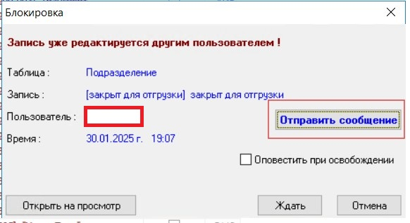
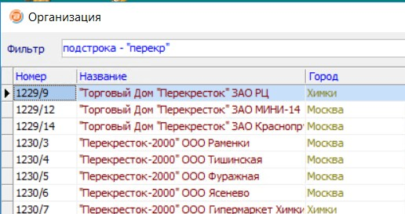
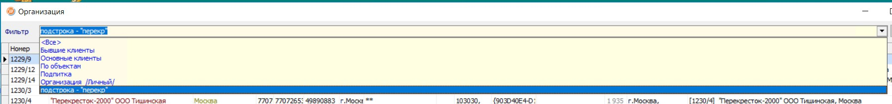

[На главную](../../index.md)

# Новое  в версии. Релиз 282 от 31.01.2025

**Условные обозначения:**
 >[номер] - номер заявки во внутренней системе учета заявок компании "БУХта".

#### Содержание: 

- Зарплата
- Отчеты
- Прочее

## Добавление новой возможности

#### 25372
В соответствии с __Приказом ФНС от 13.09.2024 № ЕД-7-11/739@ и письмом «О применении единых пониженных тарифов страховых взносов и представлении расчета по страховым взносам» (от 28.11.2024 № ПА-4-11/13524@),__ в справочники БУХты добавлены новые коды категорий плательщиков, применяющих пониженные тарифы и новые коды застрахованного лица. 

#### 25398
Фондом пенсионного и социального страхования Российской Федерации реализована возможность направления страхователями заявлений на возмещение расходов на оплату дополнительных выходных дней для ухода за детьми-инвалидами в форме электронного документа.
В БУХте добавлена возможность выгружать __Заявление на возмещение расходов на оплату дополнительных выходных дней для ухода за детьми-инвалидами__ в xml-файл (форма __З/П Печать Заявления в ФСС о возмещении расходов__), для этого на экране формы добавлены признаки __Составить отчет__ и __Выгрузить данные в xml-файл__, при проставлении соответствующего признака либо создается отчет либо файл.

#### 25368
В соответствии с __Приказом ФНС России от 13.09.2024 N ЕД-7-11/739@__, внесены изменения в формат выгрузки в `xml-файл` отчета __Расчет по страховым взносам (РСВ)__, который выгружается из формы __З/П. Экспорт в XML-файл РСВ для ФНС__:
- начиная с отчета за 1 квартал 2025 г. xml-файл выгружается в новом формате 5.07,
- в Подраздел 3.2.1 добавлена графа 141 сумма выплат по договорам ГПХ за каждый месяц отчетного квартала,
- физическим лицам, в пользу которых выплаты в последние три месяца не начислялись, код категории меняется на «НВ»,
- на закладке "Пониж.тарифы" добавлена возможность указать тариф для обрабатывающих производств по ОКВЭД.
В поставку версии добавлен tiff-шаблон 1151111_5.07000_10 для печати РСВ в формате 5.07 с 1 квартала 2025 г.

#### 25385
В окне __Таблица уже редактируется другим пользователем__ добавлена возможность отправки сообщение пользователю вызвавшему блокировку.
  
  

Текст соообщения и адресат заполняются автоматически.
Перед отправкой текст сообщения можно изменить.

## Усовершенствование

#### 25389
При вводе подстроки, в поле являющемся ссылкой на справочник открывается список содержащий строки содержащие эту подстроку. В назавании фильтра указывается введенная подстрока.
Так же фильтр с этим названием появляется в выпадающем списке доступных фильтров. Но при выборе этого значения из списка возникала ошибка и фильтр не применялся. 
>В новом релизе сообщение об ошибке не появляется. Фильтр применяется корректно.

>>например: 
- введем подстроку  __перекр__, 
  
- открывается список содержащий строки содержащие подстроку __перекр__

- фильтр с этим названием появляется в выпадающем списке доступных фильтров
подстроки _перекр_. 
  

## Исправление ошибок

#### 25365
Исправлен алгоритм сбора данных для печати шаблона __З/П Справка о доходах 2025г__ (процедура ___З/П Справка о доходах (2025г.)__): 
- теперь налоговая база округляется в соответствии с настройкой (меню Зарплата-Основная настройка закладка "Подоходный"), а суммы исчисленного НДФЛ округляются в соответствии с настройкой шифра.

#### 25369
С 1 октября 2024 года в СФР изменились регистрационные номера страхователей. В связи с этим в БУХте в карточке настройки Юридического лица (меню __Справочники-Настройка-Организации-Юридические лица__) на закладке __Отчетность в фонды__ добавлено поле __Регистрационный номер в СФР__.
Если это поле заполнено, то в отчете ЕФС-1, а также в xml-файлах ЕФС-1 в качестве регистрационного номера берется значение этого поля. Если новое поле не заполнено, то как и раньше, берется значение поля __Регистрационный номер в ПФР__.

#### 25371
В соответствии с поправками, принятыми в статью 427 НК, с 2025 года введены новые пониженные тарифы страховых взносов для компаний, которые одновременно входят в реестр МСП; имеют основной код по ОКВЭД из группы обрабатывающего производства, кроме производства напитков, табачных изделий, кокса и нефтепродуктов, а также производства металлургической продукции (точный список видов деятельности установит правительство); получили от основной деятельности минимум 70% в общем объёме дохода за предыдущий год и текущий отчётный период. Методика расчёта доходов зависит от системы налогообложения.
Такие экономические субъекты будут платить страховые взносы за сотрудников по тарифу: с выплаты до 1,5 х МРОТ – 30%; с выплаты свыше 1,5 х МРОТ – 7,6%.
В БУХте внесены соответствующие изменения:
- доработан алгоритм расчета страховых взносов с 2025 года
- добавлена настройка на новый тариф расчета страховых взносов в меню Зарплата-Основная настройка-Настройки для Юр.лица (форма __Стандартная. Настройки ЗП для Юр.лица__): 
- на экране добавлен признак __Тариф для обабатывающих производств (по отдельным ОКВЭД)__ (следует выбрать режим __Пониженные тарифы для доходов свыше МРОТ__ и проставить этот признак).

#### 25378
Исправлена ошибка, возникающая при составлении шаблона __З/П Справка о доходах 2024г__ при проставленных признаках __По обосбл подразделенифм По Поставщику__ и __выделять сумму фикс.аванс.платежей__, если у сотрудника есть аванс.платежи.

#### 25381
Исправлена ошибка в алгоритме составления Раздела 1.2 ЕФС-1 за 2024: в отчет не попадали данные о сотрудниках, которые были приняты на работу в 2024 году.

## Информация для разработчиков

#### 25389
Для полей типов __Ссылка__ или __Субконто__ происходил сброс фильтра установленного разработчиком `(Edit.LookupFilter)`

1. Установить `LookupFilter`
2. Ввести в текстовое поле не существующее значение в списке
3. Нажать Enter
4. Загрузится список всех записей (с примененным `LookupFilter`)
5. Выбрать в форме фильтр __<Все>__
6. Загрузится список всех записей без ограничений указанных в `LookupFilter`
>Ограничения должны применяться. __Ошибка исправлена__.

[подробнее о конфигурации зарплата](Стандартная_Зарплата.htm)

>[скачать версию **Buhta20250131.zip**](Buhta20250131.zip)
